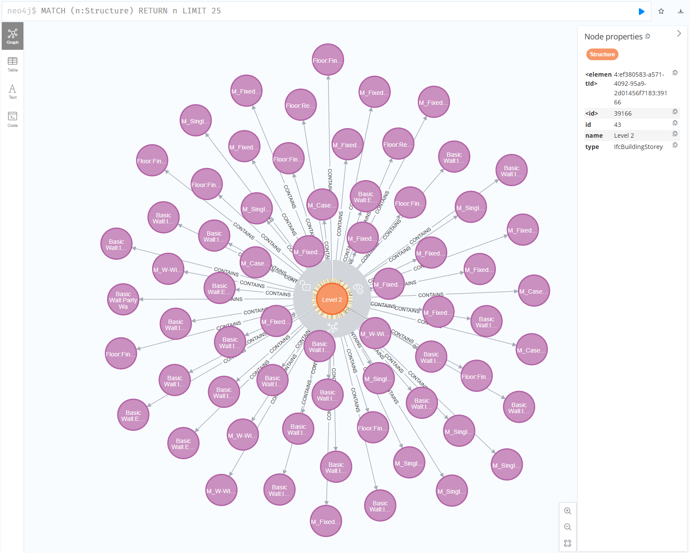

# IFC Graph Database

A Python tool that extracts building elements from IFC (Industry Foundation Classes) BIM model files and stores them in a Neo4j graph database. The tool filters physical entities (walls, doors, windows, columns, etc.) to create a structured graph representation of building components and their relationships.



## Features

- **Batch Processing**: Efficiently processes IFC files using batch database operations for improved performance
- **Configurable Element Types**: Customize which IFC element types to extract via YAML configuration
- **Rich Graph Model**: Extracts elements, spatial structures, materials, and property sets
- **Safe Database Operations**: Optional database clearing with `--clear-db` flag (preserves existing data by default)
- **Robust Error Handling**: Graceful handling of invalid files and connection issues
- **CLI Interface**: Full command-line interface with multiple options
- **Dry Run Mode**: Preview what would be imported without modifying the database

## Prerequisites

- Python 3.9+
- Neo4j Database (4.x or 5.x)
- An IFC file to process

## Installation

### 1. Clone the Repository

```bash
git clone https://github.com/yourusername/ifc-graph-database.git
cd ifc-graph-database
```

### 2. Set Up Virtual Environment

#### Linux/macOS

```bash
# Create virtual environment
python -m venv your-virtual-environment-name

# Activate the environment
source your-virtual-environment-name/bin/activate
```

#### Windows (Command Prompt)

```cmd
# Create virtual environment
python -m venv your-virtual-environment-name

# Activate the environment
your-virtual-environment-name\Scripts\activate.bat
```

#### Windows (PowerShell)

```powershell
# Create virtual environment
python -m venv your-virtual-environment-name

# Activate the environment
your-virtual-environment-name\Scripts\Activate.ps1
```

### 3. Install Dependencies

```bash
pip install -r requirements.txt
```

### 4. Configure Environment Variables

Create a `.env` file in the project root (you can copy from the example):

```bash
cp .env.example .env
```

Edit `.env` with your Neo4j credentials:

```env
NEO4J_URI=bolt://localhost:7687
NEO4J_USER=neo4j
NEO4J_PASSWORD=your_password_here
IFC_FILE_PATH=./test_model.ifc
```

### 5. Configure Element Types (Optional)

Edit `config.yaml` to customize which IFC element types to extract:

```yaml
element_types:
  - IfcWall
  - IfcDoor
  - IfcWindow
  - IfcColumn
  - IfcBeam
  - IfcSlab
  # Add or remove types as needed

extraction:
  include_property_sets: true
  include_materials: true
  max_properties_per_element: 50
```

## Usage

### Basic Usage

Run with default settings from `.env` and `config.yaml`:

```bash
python main.py
```

### Command-Line Options

```bash
# Process a specific IFC file
python main.py --ifc-file path/to/model.ifc

# Clear database before importing (WARNING: deletes all existing data)
python main.py --clear-db

# Use a custom configuration file
python main.py --config custom_config.yaml

# Preview what would be imported (no database changes)
python main.py --dry-run

# Set logging level
python main.py --log-level DEBUG

# Override Neo4j connection (useful for different environments)
python main.py --neo4j-uri bolt://production:7687 --neo4j-user admin --neo4j-password secret
```

### Full CLI Reference

```
usage: main.py [-h] [--ifc-file IFC_FILE] [--config CONFIG] [--clear-db]
               [--neo4j-uri NEO4J_URI] [--neo4j-user NEO4J_USER]
               [--neo4j-password NEO4J_PASSWORD]
               [--log-level {DEBUG,INFO,WARNING,ERROR}] [--dry-run]

Options:
  --ifc-file        Path to the IFC file to process
  --config          Path to configuration file (default: config.yaml)
  --clear-db        Clear database before importing
  --neo4j-uri       Neo4j connection URI
  --neo4j-user      Neo4j username
  --neo4j-password  Neo4j password
  --log-level       Logging level (DEBUG, INFO, WARNING, ERROR)
  --dry-run         Preview import without database changes
```

## Project Structure

```
ifc-graph-database/
├── main.py                    # Main entry point with CLI
├── config.yaml                # Element types and extraction settings
├── requirements.txt           # Python dependencies
├── .env.example               # Environment variables template
├── graph_processor/
│   ├── __init__.py
│   ├── element_filter.py      # IFC file parsing and element extraction
│   ├── neo4j_store.py         # Database operations with batch processing
│   └── query_loader.py        # Loads Cypher queries from files
└── cypher_queries/            # External Cypher query files
    ├── clear_database.cypher
    ├── create_project.cypher
    ├── create_elements_batch.cypher
    ├── create_structures_batch.cypher
    ├── create_materials_batch.cypher
    └── ...
```

## Graph Model

The tool creates the following node types in Neo4j:

- **Project**: The IFC project container
- **Element**: Physical building elements (walls, doors, windows, etc.)
- **Structure**: Spatial structures (sites, buildings, storeys, spaces)
- **Material**: Material definitions linked to elements
- **Metadata**: Import metadata with timestamps and statistics

### Relationships

- `(Project)-[:CONTAINS]->(Element)`
- `(Structure)-[:CONTAINS]->(Element)`
- `(Element)-[:HAS_MATERIAL]->(Material)`


## Troubleshooting

### Connection Issues

If you can't connect to Neo4j:
1. Ensure Neo4j is running
2. Check that the URI, username, and password are correct
3. Verify the port is not blocked by a firewall

### IFC File Errors

If the IFC file fails to load:
1. Ensure the file exists and is readable
2. Verify it has a `.ifc` or `.ifczip` extension
3. Check that the file is not empty or corrupted

### Performance

For large IFC files:
- Increase the batch size in the code if needed
- Consider filtering fewer element types in `config.yaml`
- Ensure Neo4j has sufficient memory allocated

## License

This project is licensed under the MIT License - see the [LICENSE](LICENSE) file for details.

**DISCLAIMER OF LIABILITY**: The authors and contributors of this software shall not be held liable for any damages, losses, or consequences arising from the use of this software. Users assume all responsibility for deploying and using this tool in their environments.

---

## AI Disclosure

> **Note**: Portions of this project were revised and enhanced with the assistance of AI tools. This includes code refactoring, implementation of batch processing, error handling improvements, configuration management, and documentation updates. All AI-assisted code has been reviewed for correctness and suitability.
